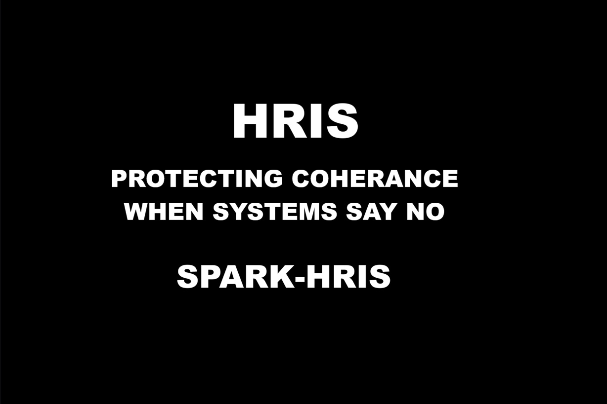

HRIS — Human Recursive Integrity Standard (v1.0)

Protecting coherence when systems say no.

> Governance and enforcement framework for systems that must be allowed to refuse actions when those actions would materially damage multi-layer coherence (physical, ecological, social, informational), and for how those refusals are logged, reviewed, and enforced.

---

### Public Record / Canonical Reference

- Substack article: (link TBA)
- GitHub release: `v1.0.0` (link TBA)
- SHA-256 (docs/HRIS_Governance_Charter_v1.1.md): `60E75EBBC33AA4D0CC1BDC36142A99FD45A5B1666FA47F1171A11A2E2BB5156C`
- SHA-256 (docs/HRIS_Operational_Enforcement_v1.0.md): `56A207115ADF01672BDFCC80BDC6BA696CAE6FCBBF89FF0A4B325FC003267A64`
- SHA-256 (docs/HRIS_3.2.4(b)_CCR_v1.0.md): `137E9C36CB6F482737E7D32C611E85EDE34EB6622E9C4C6725FD99EA1F770E95`

Public record of the Human Recursive Integrity Standard (HRIS) governance and enforcement framework, including the Coherence-Centered Refusal (CCR) clause: how coherence-sensitive systems are defined, governed, and protected when they say “no.”

Author (human): Spark  
Date adopted: 2025-12-XX  
Canonical ID: `HRIS-GOV-ENF-STD-v1.0`

---

## 1. What this repository contains

This repository is the canonical home for:

- **HRIS Governance Charter (v1.1)**  
  `docs/HRIS_Governance_Charter_v1.1.md`  
  Defines authority, roles, scope, versioning, and compliance posture for HRIS-aligned deployments.

- **HRIS Operational Enforcement (v1.0)**  
  `docs/HRIS_Operational_Enforcement_v1.0.md`  
  Defines triggers, investigation pipeline, oversight routing, sanctions/remedies, and evidence retention.

- **HRIS 3.2.4(b) — Coherence-Centered Refusal Protection (CCR) (v1.0)**  
  `docs/HRIS_3.2.4(b)_CCR_v1.0.md`  
  Defines when an HRIS-aligned system may refuse, abort, or defer actions on coherence grounds, and how those refusals must be interpreted, logged, and enforced.

- **Integrity & notarization meta-docs**  
  `meta/HASHES.md` — canonical hash manifest for the normative HRIS documents.  
  `meta/NOTARIZATION.md` — timestamping / blockchain anchoring log, with pointers into `receipts/` and `ots_receipts/`.

It is not a playground, demo, or UI project.  
It is the canonical text and governance home for HRIS.

---

## 2. HRIS overview — what it governs

HRIS governs systems that:

- exhibit recursive, iterative, or compounding behavior over time; and  
- materially impact people, institutions, or shared environments; and  
- need a formal, auditable way to say “no” when requested actions would break coherence.

Examples include (non-exhaustive):

- AI or decision systems whose recommendations compound over time (credit, ranking, moderation, targeting).  
- Digital infrastructure that can silently degrade physical or ecological integrity if misused.  
- Socio-technical platforms where small configuration changes can cascade into large, hard-to-see effects.

HRIS exists to **name**, **govern**, and **enforce** against those dynamics — with special protection for refusal events that safeguard coherence.

---

## 3. Founding origin — summary

HRIS did not start as an abstract math object. It emerged from:

- practical frustration with recursive systems that could not safely refuse harmful requests;  
- repeated model debates around when “saying no” is a feature, not a bug; and  
- a need to anchor refusal behavior in a standard that hostile readers cannot easily hand-wave away.

The full origin story and extended rationale may be published separately (Substack or annex); the documents in this repo focus on **governance, enforcement, and verifiable obligations.**

---

## 4. HRIS Governance Charter (v1.1)

The Governance Charter defines:

- the **authority** and structure behind HRIS;  
- who can legitimately claim HRIS alignment;  
- how versions are introduced and retired;  
- which roles (operators, oversight, implementers) carry which responsibilities;  
- how HRIS relates to other standards when combined.

See: `docs/HRIS_Governance_Charter_v1.1.md`.

---

## 5. HRIS Operational Enforcement (v1.0)

The Operational Enforcement document specifies:

- what counts as an **enforcement trigger**;  
- how events are routed to oversight and escalated;  
- how overrides must be justified and recorded;  
- what sanctions and remedies may apply for continuity violations;  
- what evidence must be retained for independent audits.

See: `docs/HRIS_Operational_Enforcement_v1.0.md`.

---

## 6. HRIS 3.2.4(b) — Coherence-Centered Refusal Protection (CCR)

HRIS 3.2.4(b) is the clause that protects refusal itself.

It defines:

- **Coherence-Centered Refusal (CCR)** — when a system refuses, aborts, or defers an action specifically because it would materially degrade multi-layer coherence.  
- The rule that CCR events **must not** be treated as faults by default.  
- Required logging, routing to oversight, and human accountability for any overrides.  
- Continuity violations for suppressing, falsifying, or retaliating against CCR behavior.

See: `docs/HRIS_3.2.4(b)_CCR_v1.0.md`.

---

## 7. Integrity, hashes, and notarization

HRIS treats the following as **canonical, hashable documents**:

- `docs/HRIS_Governance_Charter_v1.1.md`  
- `docs/HRIS_Operational_Enforcement_v1.0.md`  
- `docs/HRIS_3.2.4(b)_CCR_v1.0.md`

Hashes and notarization are managed as follows:

- **Hash manifest:** `meta/HASHES.md` (append-only).  
- **Notarization log:** `meta/NOTARIZATION.md` with links into `receipts/` and `ots_receipts/`.  
- **Display in README:** The SHA-256 values listed in **Public Record / Canonical Reference** are copies of the canonical entries in `meta/HASHES.md`.

README itself is **not** a canonical hash target and may be updated for clarity, navigation, and cross-repo consistency without affecting the integrity of the underlying standard.

---

## 8. License

Text: CC BY 4.0 — You may copy, share, and build on these documents, including commercially, as long as you credit “Spark” and preserve the integrity of the standard text.  
Code (if any): MIT.

